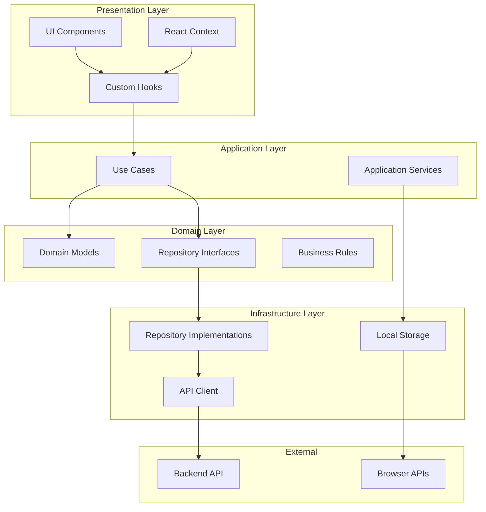
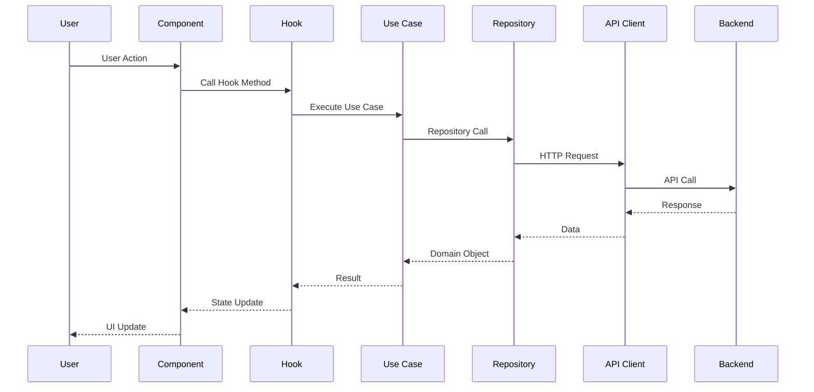
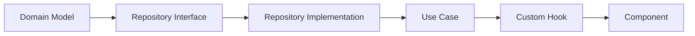

# Frontend Clean Architecture - Functional Approach

A modern React + TypeScript application built using **functional clean architecture** principles with React Router v7, Tailwind CSS v4, and a focus on maintainability and testability.

## 🏗️ Architecture Overview

This project implements a **functional clean architecture** pattern that emphasizes:

- **Pure functions** for domain logic and business rules
- **Dependency injection through React hooks** instead of complex DI containers
- **Clear separation of concerns** across architectural layers
- **Framework independence** in core business logic
- **Type safety** throughout the entire application stack

## 📊 Architecture Diagram



## 🔄 Data Flow Diagram



## 📁 Project Structure

```
app/
├── app.css                    # Tailwind v4 zero-config CSS
├── root.tsx                   # React Router root layout
├── routes.ts                  # Route definitions
├── shared-kernel.d.ts         # Global type definitions
│
├── presentation/              # 🎨 Presentation Layer
│   ├── components/           # React components (UI)
│   ├── hooks/               # Custom hooks (DI layer)
│   └── context/             # React context providers
│
├── application/              # 🔧 Application Layer
│   ├── use-cases/           # Business use cases
│   └── services/            # Application services
│
├── domain/                   # 🧠 Domain Layer
│   ├── model/               # Domain entities & value objects
│   └── repositories/        # Repository interfaces
│
├── infrastructure/           # 🔌 Infrastructure Layer
│   ├── api/                 # HTTP client & API utilities
│   ├── repositories/        # Repository implementations
│   └── services/            # Infrastructure services
│
├── components/               # 🧩 Shared UI Components
│   └── ui/                  # Reusable UI primitives
│
└── lib/                     # 📚 Utility functions
    └── utils.ts             # Common utilities
```

## 🎯 How It Works

### 1. **Domain Layer** - The Heart of the Application

The domain layer contains pure business logic and is completely framework-agnostic:

```typescript
// Domain Model (Pure Function)
export function createConfident(data: CreateConfidentRequest): Confident {
  return {
    id: 0, // Will be set by backend
    title: data.title,
    description: data.description,
    user_id: data.user_id,
    created_at: new Date().toISOString(),
    updated_at: new Date().toISOString(),
  };
}

// Business Rules (Pure Function)
export function isConfidentValid(confident: Confident): boolean {
  return confident.title.length > 0 && confident.description.length > 0;
}
```

### 2. **Application Layer** - Orchestrating Business Logic

Use cases coordinate between domain logic and infrastructure:

```typescript
export async function createNewConfident(
  confidentData: CreateConfidentRequest,
  userId: number,
  confidentRepository: ConfidentRepository,
  notifier: NotificationService
): Promise<Confident> {
  // Domain logic
  const newConfident = createConfident({ ...confidentData, user_id: userId });

  if (!isConfidentValid(newConfident)) {
    throw new Error("Invalid confident data");
  }

  // Infrastructure interaction
  const response = await confidentRepository.create(confidentDataWithUserId);
  notifier.success("Confident created successfully!");

  return response.confident;
}
```

### 3. **Infrastructure Layer** - External Dependencies

Handles API calls, local storage, and other external concerns:

```typescript
// Repository Implementation
export class ConfidentRepositoryImpl implements ConfidentRepository {
  async create(data: CreateConfidentRequest): Promise<ApiResponse<Confident>> {
    return apiClient.post<Confident>("/confidents", data);
  }
}

// API Client with SSR Support
const API_BASE_URL = isServer
  ? "http://localhost:5001/api" // Server-side
  : "/api"; // Client-side (proxy)
```

### 4. **Presentation Layer** - React Integration

Custom hooks provide dependency injection and state management:

```typescript
export function useConfidents() {
  const confidentRepository = useConfidentRepository();
  const notifier = useNotifier();
  const userStorage = useUserStorage();

  const createConfident = useCallback(
    async (confidentData) => {
      const user = userStorage.getUser();
      if (!user) throw new Error("User not authenticated");

      return createNewConfident(
        confidentData,
        user.id,
        confidentRepository,
        notifier
      );
    },
    [confidentRepository, notifier, userStorage]
  );

  return { create: createConfident /* ... */ };
}
```

### 5. **Component Layer** - UI Implementation

Components are purely presentational and use hooks for business logic:

```typescript
export function ConfidentForm() {
  const { create } = useConfidents();
  const form = useForm<CreateConfidentRequest>({
    resolver: zodResolver(confidentSchema),
  });

  const onSubmit = async (data: CreateConfidentRequest) => {
    try {
      await create(data);
      form.reset();
    } catch (error) {
      // Error handling is done in use case
    }
  };

  return (
    <Form {...form}>
      <form onSubmit={form.handleSubmit(onSubmit)}>{/* Form fields */}</form>
    </Form>
  );
}
```

## 🎨 Styling with Tailwind CSS v4

The application uses Tailwind CSS v4 with zero-config setup:

```css
@import "tailwindcss";
@import "tw-animate-css";

@theme {
  --font-sans: "Inter", ui-sans-serif, system-ui, sans-serif;
}

:root {
  --radius: 0.625rem;
  --background: oklch(1 0 0);
  --foreground: oklch(0.145 0 0);
  /* ... more design tokens */
}
```

### Key Features:

- **Zero-config** - No `tailwind.config.js` needed
- **CSS Variables** - Design tokens for theming
- **Dark Mode** - Automatic dark mode support
- **Custom Variants** - Extended functionality

## 🚀 Key Technologies

| Technology          | Purpose               | Version  |
| ------------------- | --------------------- | -------- |
| **React Router**    | Routing & SSR         | v7.5.3   |
| **React**           | UI Framework          | v19.1.0  |
| **TypeScript**      | Type Safety           | v5.8.3   |
| **Tailwind CSS**    | Styling               | v4.1.11  |
| **React Hook Form** | Form Management       | v7.59.0  |
| **Zod**             | Schema Validation     | v3.25.67 |
| **Axios**           | HTTP Client           | v1.10.0  |
| **Radix UI**        | Accessible Components | Latest   |

## 🔧 Development Workflow

### 1. **Adding a New Feature**



### 2. **Testing Strategy**

- **Domain Logic**: Pure functions, easy to unit test
- **Use Cases**: Mock dependencies, test business flows
- **Hooks**: React Testing Library for integration tests
- **Components**: Visual regression and interaction tests

### 3. **State Management**

- **Local State**: React `useState` for component-specific state
- **Global State**: React Context for app-wide state (auth, notifications)
- **Server State**: Custom hooks with repository pattern
- **Form State**: React Hook Form with Zod validation

## 🛠️ Getting Started

### Prerequisites

- Node.js 18+
- npm or yarn
- Backend API running on port 5001

### Installation

```bash
cd frontend-2
npm install
```

### Development

```bash
npm run dev
```

The application will be available at `http://localhost:5173`

### Build

```bash
npm run build
```

### Type Checking

```bash
npm run typecheck
```

## 🔍 Troubleshooting

### Common Issues

1. **Styling Issues**

   - Ensure `app/app.css` contains only Tailwind v4 imports
   - Check that `app/app.css` is imported in `app/root.tsx`
   - No custom Tailwind config unless needed

2. **API Connection Issues**

   - Verify backend is running on port 5001
   - Check CORS configuration in backend
   - Ensure authentication cookies are being sent

3. **Type Errors**
   - Run `npm run typecheck` to identify issues
   - Check `shared-kernel.d.ts` for global type definitions
   - Verify repository interfaces match implementations

### Development Tips

- **Hot Reload**: Changes are reflected immediately during development
- **Type Safety**: TypeScript catches most errors at compile time
- **Error Boundaries**: React Router provides error handling
- **SSR Ready**: Application works with server-side rendering

## 📚 References

- [Frontend Clean Architecture](https://github.com/bespoyasov/frontend-clean-architecture)
- [React Router v7 Documentation](https://reactrouter.com/)
- [Tailwind CSS v4 Documentation](https://tailwindcss.com/docs/installation)
- [Functional Programming in TypeScript](https://www.typescriptlang.org/docs/)

## 🤝 Contributing

1. Follow the functional clean architecture principles
2. Write pure functions for domain logic
3. Use TypeScript for type safety
4. Test business logic independently
5. Keep components purely presentational

---

**Built with ❤️ using functional clean architecture principles**
